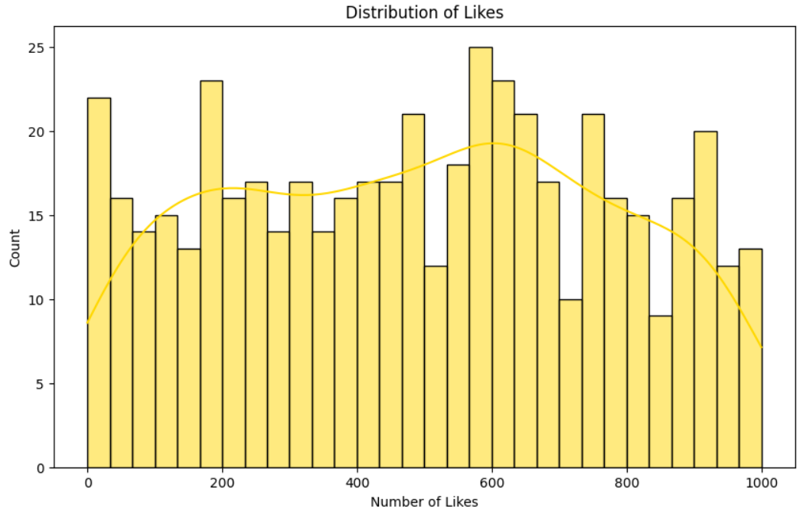
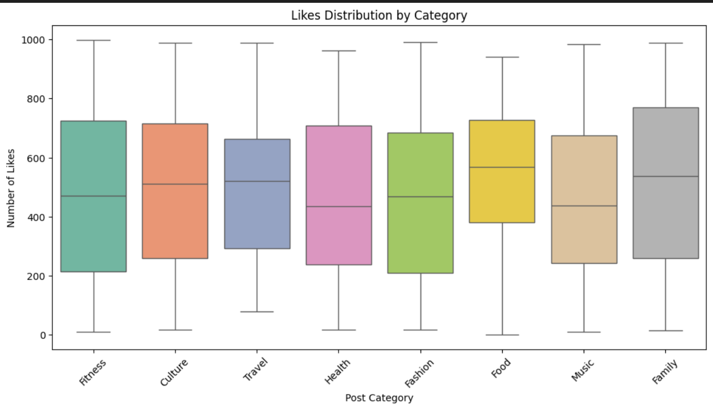
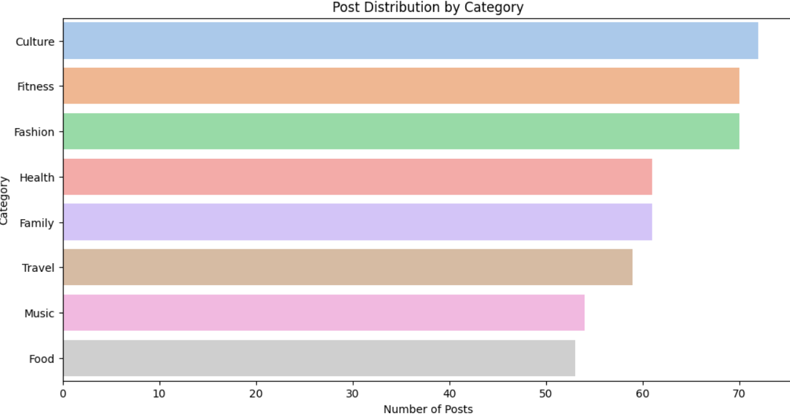
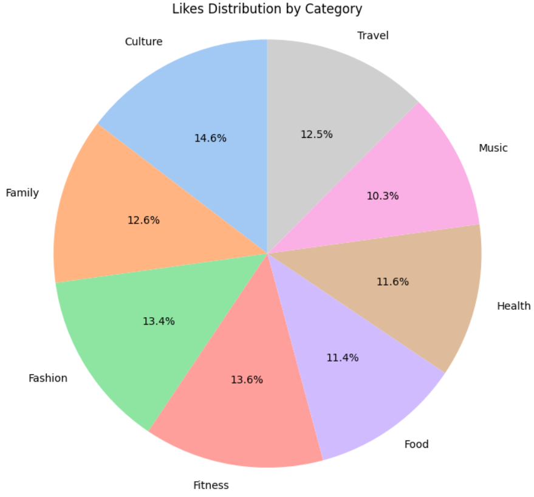

# Social Media Post Performance Analysis

## Project Overview
In this project, I took on the role of a social media analyst tasked with analyzing post performance across multiple categories. I simulated tweet-like data for categories such as Fitness, Food, Travel, and Health over a 500-day period, generating random likes to mimic real engagement data.

The goal was to clean, analyze, and visualize this data to provide actionable insights for optimizing social media strategies and increasing client engagement.

---

## Process and Methodology
- **Data Generation:** Created a synthetic dataset using Python libraries including pandas, numpy, and random, simulating post dates, categories, and engagement metrics.
- **Data Cleaning:** Removed duplicates and null values, converted data types appropriately, ensuring the dataset’s integrity.
- **Exploratory Analysis:** Used statistical summaries, histograms, and boxplots to understand the distribution and variability of likes across categories.
- **Visualization:** Leveraged Seaborn and Matplotlib to produce clear and insightful charts illustrating engagement trends and category performance.

---

## Key Findings
- Categories like **Travel** and **Fitness** consistently showed higher median likes, indicating greater engagement.
- Some categories, such as **Culture**, had more variability in engagement, suggesting niche interest groups or inconsistent post performance.
- Overall, data-driven insights reveal which content categories resonate best with audiences, enabling targeted strategy adjustments.

---

## Challenges and Solutions
- **Simulating realistic data:** Generating meaningful random data that reflected real-world trends required careful tuning of ranges and distributions.
- **Visual clarity:** Ensuring plots remained readable with multiple categories involved adjusting figure sizes and choosing appropriate chart types (e.g., switching from pie charts to bar graphs).
- **Balancing detail and simplicity:** Providing enough insight without overwhelming the audience was key; statistical summaries complemented visualizations effectively.

---

## Project Artifacts

### Visualizations

**Histogram of Likes Distribution:**  


**Boxplot of Likes by Category:**  


**Bar Chart of Post Distribution by Category:**  


**Piechart Chart of Likes Distribution by Category:**  


---

### Code Excerpts

# Generate random tweet-like data
```python
import pandas as pd
import numpy as np
import random

categories = ['Food', 'Travel', 'Fashion', 'Fitness', 'Music', 'Culture', 'Family', 'Health']
data = {
    'Date': pd.date_range('2020-01-01', periods=500),
    'Category': [random.choice(categories) for _ in range(500)],
    'Likes': np.random.randint(0, 10000, size=500)
}
df = pd.DataFrame(data)
```

# Visualize post distribution by category using bar plot
```python
import seaborn as sns
import matplotlib.pyplot as plt

category_counts = df['Category'].value_counts().reset_index()
category_counts.columns = ['Category', 'Count']

sns.barplot(y='Category', x='Count', data=category_counts, palette='pastel', hue='Category', dodge=False, legend=False)
plt.xlabel('Number of Posts')
plt.ylabel('Category')
plt.title('Post Distribution by Category')
plt.show()
```
